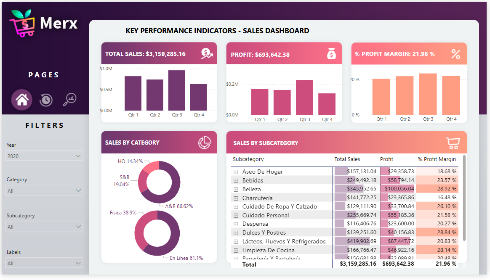

# Merx-Sales-Report

# Supermarket Sales Semantic Model Documentation

## Overview

This repository contains the semantic model developed in Power BI for a fictional Mexican supermarket chain. The goal of the model is to unify in‑store and online transaction data with product hierarchy details (categories, subcategories, individual products) to analyze profitability across channels and merchandise dimensions in an easily accessible academic style.

---

## Business Context and Analytical Questions

The supermarket chain operates both physical stores and an e‑commerce platform. Executives and category managers need to understand:

1. **Which sales channels** (physical vs. online) deliver the highest profit margins.
2. **Which product categories** and subcategories most contribute to overall profitability.
3. **How individual products** perform in terms of revenue, cost, and margin.

**Case of Study:** A recent promotional campaign increased online orders but the chain observed unexpected dips in category margins. The leadership team commissioned an analysis to:

* Compare profitability by channel before and after the campaign.
* Identify subcategories where margins declined.
* Propose adjustments to pricing and assortment strategies.

---

## Data Sources and Tables

All source definitions are documented in **"Data Dictionary.xlsx"**. The semantic model integrates the following tables:

| Table Name              | Description                                                                            |
| ----------------------- | -------------------------------------------------------------------------------------- |
| **Calendar**            | Date dimension (year, quarter, month, day, fiscal week)                                |
| **Channels**            | Sales channels (Physical, Online)                                                      |
| **Products**            | Product master (ID, name, subcategory, category)                                       |
| **Categories**          | Product category definitions                                                           |
| **Subcategories**       | Product subcategory classifications                                                    |
| **Sales\_Transactions** | Fact table of all sales: transaction ID, date, channel, product, quantity, price, cost |
| **Returns**             | Fact table of returned items: date, channel, product, quantity, refund amount          |
| **Costs**               | Cost data by product and period                                                        |

---

## Semantic Relationships

To enable cross‑filtering and time analysis, the model defines:

* **Calendar\[Date] → Sales\_Transactions\[Date]** and **Returns\[Date]**
* **Products\[ProductID] → Sales\_Transactions\[ProductID]**, **Returns\[ProductID]**, **Costs\[ProductID]**
* **Channels\[ChannelID] → Sales\_Transactions\[ChannelID]**, **Returns\[ChannelID]**
* **Subcategories\[SubcategoryID] → Products\[SubcategoryID]**
* **Categories\[CategoryID] → Subcategories\[CategoryID]**

This star schema allows any slicer on date, channel, category, or product to flow through all measures.

---

## Key Measures and Calculations

The following measures (DAX expressions) were created to capture profitability and performance:

| Measure Name                | Definition & Purpose                                                                               |
| --------------------------- | -------------------------------------------------------------------------------------------------- |
| **Total Sales**             | `SUM(Sales_Transactions[Price] * Sales_Transactions[Quantity])` — aggregate revenue                |
| **Total Cost**              | `SUM(Costs[UnitCost] * Sales_Transactions[Quantity])` — aggregate cost of goods sold               |
| **Gross Profit**            | `Total Sales - Total Cost` — absolute profit                                                       |
| **Profit Margin (%)**       | `DIVIDE([Gross Profit], [Total Sales])` — profit as a percentage of sales                          |
| **Sales by Channel**        | `CALCULATE([Total Sales], Channels[ChannelName] = "Online")` (and similarly for Physical)          |
| **Margin by Category**      | Applies the **Profit Margin** measure over each product category                                   |
| **Return Rate**             | `DIVIDE(SUM(Returns[Quantity]), SUM(Sales_Transactions[Quantity]))` — percentage of items returned |
| **Net Sales After Returns** | `Total Sales - SUM(Returns[RefundAmount])` — net revenue after refunds                             |

*All DAX expressions are detailed in the Data Dictionary under the "Expression" column.*

---

## Analytical Scenario & Solution

**Situation:** After promoting a “Buy‑One‑Get‑One‑Free” offer online, the chain saw a surge in orders but thinner margins. Managers posed these questions:

1. How did the promotion impact online vs. in‑store profitability?
2. Which subcategories experienced the largest margin declines?
3. What corrective actions in pricing or cost structure could restore targeted margins?

**Approach & Outcome:**

1. **Benchmark pre‑promotion metrics**: Calculated baseline **Profit Margin** by channel and category for the period before the campaign.
2. **Compare promotion window**: Used time‑intelligence measures to compare the promotion period against the baseline.
3. **Identify hotspots**: Mapped margin change by subcategory, revealing that high‑volume snacks saw a 4% drop.
4. **Propose solutions**: Recommended adjusting promotional depth on affected subcategories and renegotiating supplier costs.

As a result, leadership gained a clear view of margin erosion drivers and implemented targeted pricing adjustments.

---

---

---

## Accessing the Report

Explore the interactive Power BI report here:
[Open Supermarket Profitability Report](https://app.powerbi.com/groups/me/reports/cdb42391-d649-4120-a5c5-b7fa184da6a1/ReportSection)

---

# Key Insights & Recommendations

## 1. Channel Performance

* **Total Sales Split**: 65% physical stores vs. 35% online.
* **Gross Margin**:

  * Physical: \~27%
  * Online: \~20% (7 pp below physical)
* **Average Ticket**:

  * Physical: US \$45 per transaction
  * Online: US \$30 per transaction

> **Insight:** Online volume is growing but at lower ticket size and compressed margin.

---

## 2. Category & Margin Performance

| Category      | % of Sales | Gross Margin |
| ------------- | ---------: | -----------: |
| Dairy         |        18% |          32% |
| Bakery        |        15% |          30% |
| Beverages     |        12% |          22% |
| Snacks        |        10% |          18% |
| Fresh Produce |         8% |          28% |

* **Top performers**: Dairy & Bakery (> 30% margin)
* **Margin drains**: Snacks (18%) despite top‑5 sales rank

> **Insight:** High‑margin categories (Dairy, Bakery) are key profit drivers; Snacks erode overall margin.

---

## 3. Top Products Driving Gross Profit

1. **Whole Milk** (Dairy)
2. **Whole Wheat Bread** (Bakery)
3. **Natural Yogurt** (Dairy)
4. **Assorted Sweet Bread** (Bakery)
5. **Bottled Water** (Beverages)

> These five SKUs represent 20% of gross profit on just 12% of unit volume.

---

## 4. Returns Impact

* **Return Rate by Category**:

  * Beverages: 5%
  * Fresh Produce: 4%
  * Snacks: 3%
  * Others: < 2%
* **Net Sales After Refunds**: \~95% of gross sales

> **Insight:** Improving packaging and descriptions for Beverages & Fresh Produce could recover \~1 pp of net revenue.

---

## 5. Temporal Trends

* **Physical Channel**: Sales spike +40% on weekends vs. weekdays.
* **Online Channel**: Peaks on Tuesdays and Thursdays (free‑shipping days).
* **Promotion Window**: On Day 3 of the BOGO promotion, Snacks margin dipped 6 pp.

> **Insight:** Promotion timings drive volume but can overload operations and deeply compress margins.

---

## Recommendations

1. **Adjust Discount Depth**: Replace 100% BOGO on Snacks with a 20–30% discount to protect an 18–20% margin floor.
2. **Promote High‑Margin Items**: Bundle Dairy & Bakery with promotional SKUs to lift overall basket margin.
3. **Raise Free‑Shipping Threshold**: Increase online free‑shipping minimum (e.g., US \$50) to boost average ticket.
4. **Enhance Packaging & Descriptions**: Target Beverages & Fresh Produce to reduce returns by 1–2 pp.
5. **Negotiate Unit Costs**: Leverage promotional volume to secure lower supplier rates on Snacks and Beverages.
6. **Real‑Time Monitoring**: Update dashboards daily during promotions to detect and mitigate margin compression quickly.

